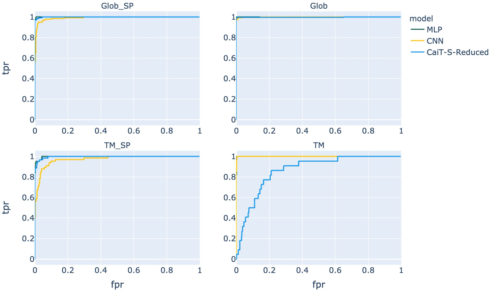
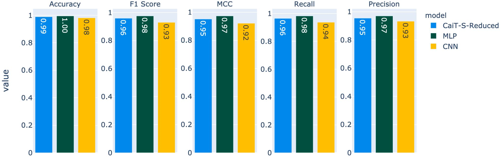
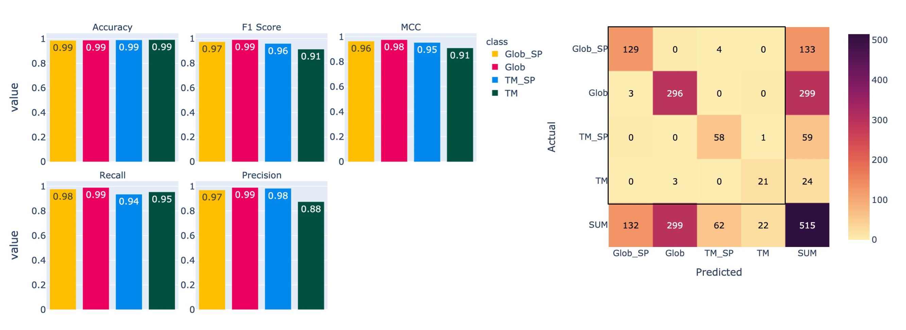
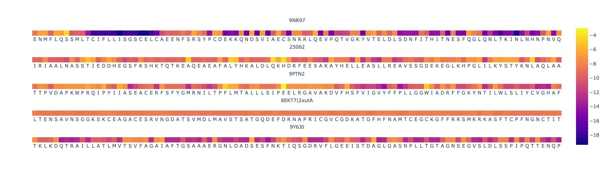

# cls-protein-prediction
Code and results for the practical exercises of the course "Protein Prediction 2" in Winter 21/22 at TUM  
Authors: Adrian Henkel, Finn Gaida, Lis Arend, Sebastian Dötsch, Shlomo Libo Feigin [1]

---
## Motivation
Transformers [2] have shown great performance for NLP and more recently vision tasks [3] as well. Here we aim to bring the class-attention mechanism [4] back to textual input tasks, namely predicting transmembrane classes directly from protein sequence embeddings [5].

## Results
We compared the _Class-attention image Transformer_ (CaiT) against a baseline _MLP_ and _CNN_ to see similar performance results.




This leads us to the conclusion that CaiT does not give a significant improvement in performance over a simple MLP baseline - presumably due to the high information density embeddings.
However one advantage of the attention mechanism is the ability to look at the attention placed at single input tokens for single predictions.



View the full metrics report [on Weights & Biases](https://wandb.ai/fga/pp2/reports/PP2-Transmembrane-Class-attention-experiments--VmlldzoxNDgyMzMx).

## Usage

1. Download the weights from [Google Drive](https://drive.google.com/drive/folders/1jaRYaAKIe5YwUb7xJKqSsAhZA1A6v7oQ?usp=sharing) and place in a folder called `models` in the root
2. Download tmh dataset from moodle or [Nextcloud](https://nextcloud.in.tum.de/index.php/s/6Hbq9QEFbgKQ5m7) (Password protected)
3. Download FASTA file for evaluation from the same source
4. Install dependencies
```
pip install -r requirements.txt
```
6. Run main script, supplying at least the following arguments
```
python main.py 
    --model_type <one of: ["CNN", "MLP", "CAIT"]>
    --emb <path to embeddings.h5> 
    --fasta <path to FASTA file>
```

## References

[1] [Final presentation slides](PP2_ClassAttention_Final.pdf)  
[2] Vaswani, Ashish, et al. "Attention is all you need." Advances in neural information processing systems 30 (2017).  
[3] Dosovitskiy, Alexey, et al. "An image is worth 16x16 words: Transformers for image recognition at scale." arXiv preprint arXiv:2010.11929 (2020).  
[4] Touvron, Hugo, et al. "Going deeper with image transformers." Proceedings of the IEEE/CVF International Conference on Computer Vision. 2021.
APA  
[5] Elnaggar, Ahmed, et al. "ProtTrans: towards cracking the language of Life's code through self-supervised deep learning and high performance computing." arXiv preprint arXiv:2007.06225 (2020).

